# Stonk (Stock Market Information Gathering LineBot)

## Introduction

Stonk is a Line Bot which can help you to gather stock market information faster and help to become stonk in stock
market!

## Finite State Machine

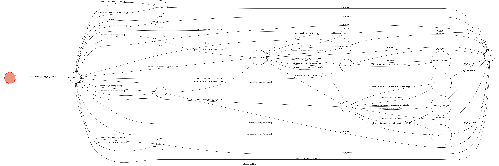

## Usage

### Menu

- Search : You can search a specific stock with a stock symbol.
- Least 5 News : You can watch least 5 news which are about the stock market.
- Top 5 Gainer & Top 5 Loser : It will show top 5 gainer and loser to help you find the perfect stock fot indaytrading.
- Introduction : SAMPLE introduction.
- Show Fsm : To get fsm graph.

### Least 5 news

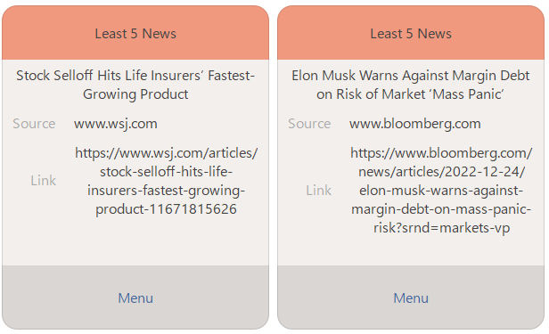

It will show news title, source and link, if you press the link you will be directed to the website.

### Top 5 Gainer & Top 5 Loser

It will show top 5 gainer and loser, if you press info, you will be directed to stock information.

### Introduction

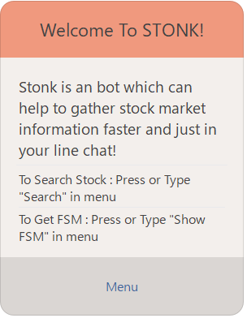

A introduction.

### Show Fsm

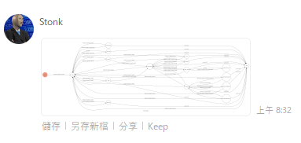

Show FSM.

### Search

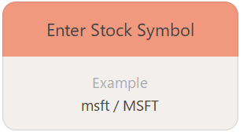

You can type in any stock symbol you want, we will be directed to that stock information.

### Stock Information

Simple information.

### Summary

Summary about what this stock about.

### Stock Chart

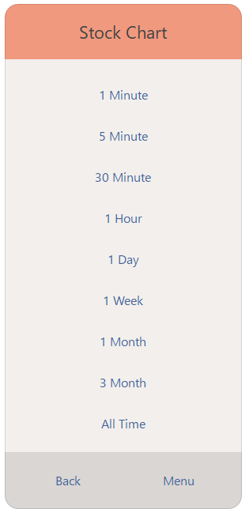
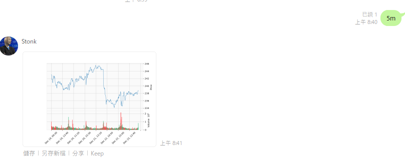

Use interval you want, and it will send that graph to you.

### New

5 news about that stock.

### Detail

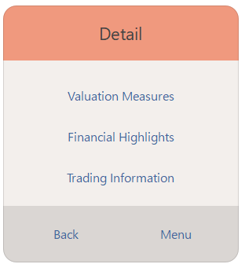
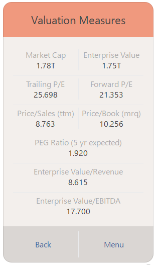
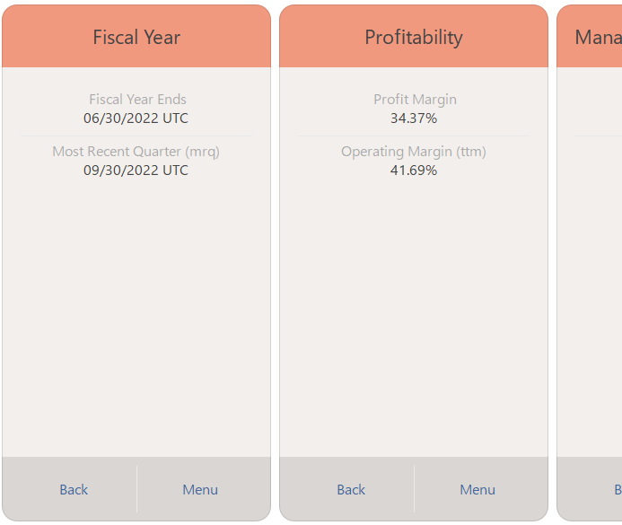
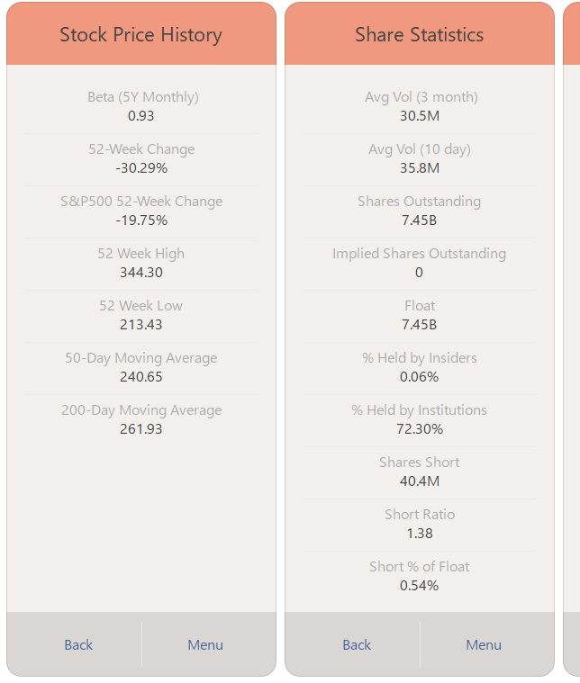

Detail information about the stock.

## Reference

[Pipenv](https://medium.com/@chihsuan/pipenv-更簡單-更快速的-python-套件管理工具-135a47e504f4)
❤️ [@chihsuan](https://github.com/chihsuan)

[TOC-Project-2019](https://github.com/winonecheng/TOC-Project-2019) ❤️ [@winonecheng](https://github.com/winonecheng)

Flask Architecture ❤️ [@Sirius207](https://github.com/Sirius207)

[Line line-bot-sdk-python](https://github.com/line/line-bot-sdk-python/tree/master/examples/flask-echo)
