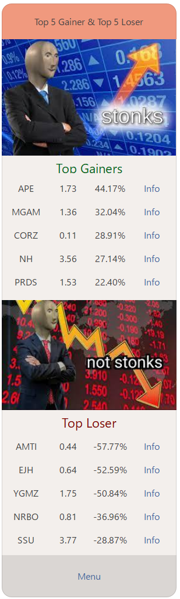

# Stonk (Stock Market Information Gathering LineBot)


## Introduction

Stonk is a Line Bot which can help you to gather stock market information faster and help to become stonk in stock
market!

## Finite State Machine


## Usage

### Menu


- Search : You can search a specific stock with a stock symbol.
- Least 5 News : You can watch least 5 news which are about the stock market.
- Top 5 Gainer & Top 5 Loser : It will show top 5 gainer and loser to help you find the perfect stock fot indaytrading.
- Introduction : SAMPLE introduction.
- Show Fsm : To get fsm graph.

### Least 5 news


It will show news title, source and link, if you press the link you will be directed to the website.

### Top 5 Gainer & Top 5 Loser



It will show top 5 gainer and loser, if you press info, you will be directed to stock information.

### Introduction


A introduction.

### Show Fsm


Show FSM.

### Search


You can type in any stock symbol you want, we will be directed to that stock information.

### Stock Information


Simple information.

### Summary


Summary about what this stock about.

### Stock Chart


Use interval you want, and it will send that graph to you.

### New


5 news about that stock.

### Detail


Detail information about the stock.

## Requirements

PIP

```bash
finvizfinance==0.14.4
Flask==1.0.2
GoogleNews==1.6.5
imgurpython==1.1.7
line_bot_sdk==1.14.0
mplfinance==0.12.9b7
pandas==1.5.2
python-dotenv==0.21.0
transitions==0.6.9
yfinance==0.2.3
```

CONDA

```bash
# This file may be used to create an environment using:
# $ conda create --name <env> --file <this file>
# platform: linux-64
_libgcc_mutex=0.1=main
_openmp_mutex=5.1=1_gnu
aiohttp=3.8.3=pypi_0
aiosignal=1.3.1=pypi_0
async-timeout=4.0.2=pypi_0
attrs=22.2.0=pypi_0
backports-zoneinfo=0.2.1=pypi_0
bs4=0.0.1=pypi_0
ca-certificates=2022.10.11=haa95532_0
certifi=2022.12.7=py38h06a4308_0
chardet=3.0.4=pypi_0
charset-normalizer=2.0.12=pypi_0
click=7.0=pypi_0
contourpy=1.0.6=pypi_0
cssselect=1.2.0=pypi_0
cycler=0.11.0=pypi_0
dateparser=1.1.4=pypi_0
datetime=4.9=pypi_0
dateutils=0.6.12=pypi_0
docopt=0.6.2=pypi_0
finviz=1.4.4=pypi_0
finvizfinance=0.14.4=pypi_0
fonttools=4.38.0=pypi_0
frozenlist=1.3.3=pypi_0
googlenews=1.6.5=pypi_0
idna=2.8=pypi_0
imgurpython=1.1.7=pypi_0
kiwisolver=1.4.4=pypi_0
ld_impl_linux-64=2.38=h1181459_1
libffi=3.4.2=h6a678d5_6
libgcc-ng=11.2.0=h1234567_1
libgomp=11.2.0=h1234567_1
libstdcxx-ng=11.2.0=h1234567_1
matplotlib=3.6.2=pypi_0
mpl-finance=0.10.1=pypi_0
mplfinance=0.12.9b7=pypi_0
multidict=6.0.4=pypi_0
ncurses=6.3=h5eee18b_3
nsetools=1.0.11=pypi_0
openssl=1.1.1s=h7f8727e_0
packaging=22.0=pypi_0
pillow=9.3.0=pypi_0
pip=22.3.1=py38h06a4308_0
pipreqs=0.4.11=pypi_0
pyparsing=3.0.9=pypi_0
python=3.8.15=h7a1cb2a_2
pytz-deprecation-shim=0.1.0.post0=pypi_0
readline=8.2=h5eee18b_0
regex=2022.10.31=pypi_0
requests=2.26.0=pypi_0
setuptools=65.5.0=py38h06a4308_0
sqlite=3.40.0=h5082296_0
tenacity=7.0.0=pypi_0
tk=8.6.12=h1ccaba5_0
tqdm=4.64.1=pypi_0
tzdata=2022.7=pypi_0
tzlocal=4.2=pypi_0
urllib3=1.26.13=pypi_0
user-agent=0.1.10=pypi_0
wheel=0.37.1=pyhd3eb1b0_0
xz=5.2.8=h5eee18b_0
yarg=0.1.9=pypi_0
yarl=1.8.2=pypi_0
zlib=1.2.13=h5eee18b_0
zope-interface=5.5.2=pypi_0
```

## Reference

[Pipenv](https://medium.com/@chihsuan/pipenv-更簡單-更快速的-python-套件管理工具-135a47e504f4)
❤️ [@chihsuan](https://github.com/chihsuan)

[TOC-Project-2019](https://github.com/winonecheng/TOC-Project-2019) ❤️ [@winonecheng](https://github.com/winonecheng)

Flask Architecture ❤️ [@Sirius207](https://github.com/Sirius207)

[Line line-bot-sdk-python](https://github.com/line/line-bot-sdk-python/tree/master/examples/flask-echo)
